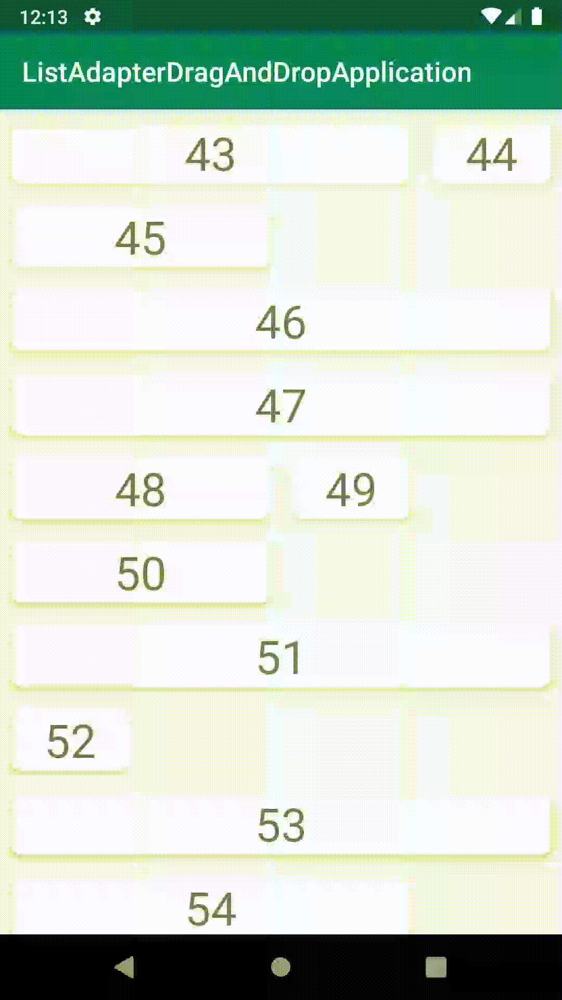

# ListAdapterDragAndDropApplication
Project that shows how ListAdapter (androidx.recyclerview:recyclerview:1.0.0) does not work properly with drag and drop

This project uses 2 versions of ListAdapter:

1. Default threading is used. Threading can't cope with animations and drag event ends abruptly. Item being dragged disappears
from the screen.

2. Synchronous executor is used: because there's no background thread or even posting to UI thread the animations happens
instantly. Drag event remains as it should be and it doesn't abruptly end.

